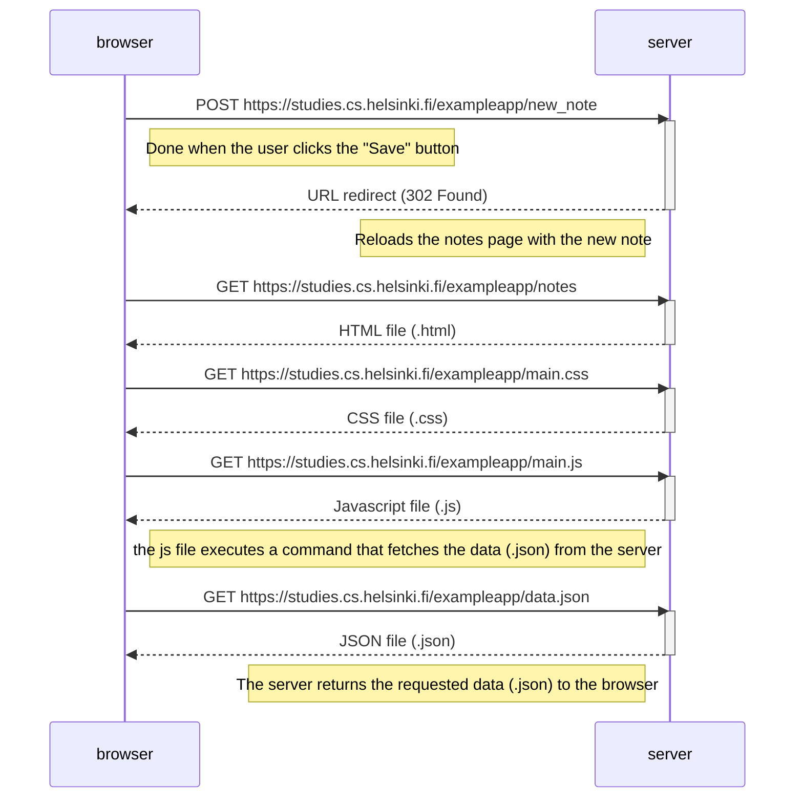

# New note Diagram

Diagram of saving a new note:

```mermaid
sequenceDiagram
    participant browser
    participant server

    browser->>server: POST https://studies.cs.helsinki.fi/exampleapp/new_note
    activate server
    Note right of browser: Done when the user clicks the "Save" button
    server-->>browser: URL redirect (302 Found)
    deactivate server
    Note left of server: Reloads the notes page with the new note

    browser->>server: GET https://studies.cs.helsinki.fi/exampleapp/notes
    activate server
    server-->>browser: HTML file (.html)
    deactivate server

    browser->>server: GET https://studies.cs.helsinki.fi/exampleapp/main.css
    activate server
    server-->>browser: CSS file (.css)
    deactivate server

    browser->>server: GET https://studies.cs.helsinki.fi/exampleapp/main.js
    activate server
    server-->>browser: Javascript file (.js)
    deactivate server
    Note right of browser: the js file executes a command that fetches the data (.json) from the server

    browser->>server: GET https://studies.cs.helsinki.fi/exampleapp/data.json
    activate server
    server-->>browser: JSON file (.json)
    deactivate server
    Note left of server: The server returns the requested data (.json) to the browser
```
