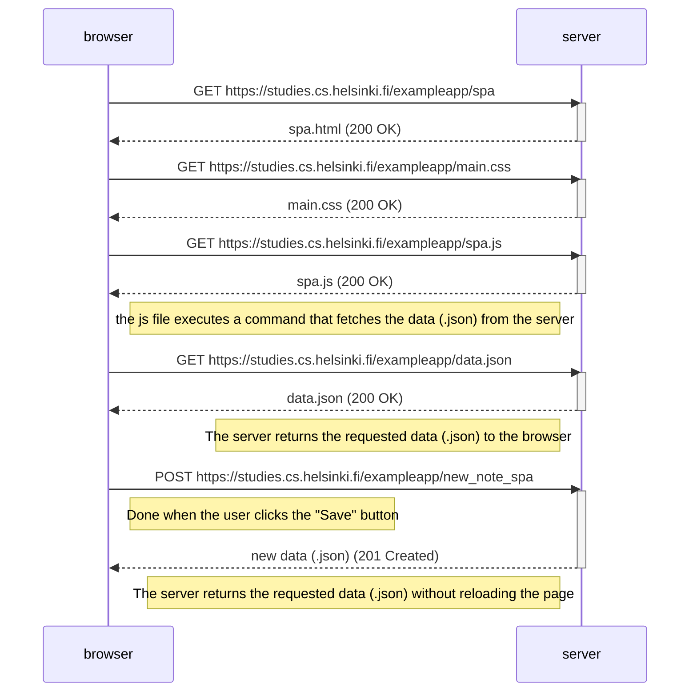

# New note in Single page app diagram

Diagram of saving a new note in a single-page app:

```mermaid
sequenceDiagram
    participant browser
    participant server

    browser->>server: GET https://studies.cs.helsinki.fi/exampleapp/spa
    activate server
    server-->>browser: spa.html (200 OK)
    deactivate server

    browser->>server: GET https://studies.cs.helsinki.fi/exampleapp/main.css
    activate server
    server-->>browser: main.css (200 OK)
    deactivate server

    browser->>server: GET https://studies.cs.helsinki.fi/exampleapp/spa.js
    activate server
    server-->>browser: spa.js (200 OK)
    deactivate server
    Note right of browser: the js file executes a command that fetches the data (.json) from the server

    browser->>server: GET https://studies.cs.helsinki.fi/exampleapp/data.json
    activate server
    server-->>browser: data.json (200 OK)
    deactivate server
    Note left of server: The server returns the requested data (.json) to the browser

    browser->>server: POST https://studies.cs.helsinki.fi/exampleapp/new_note_spa
    activate server
    Note right of browser: Done when the user clicks the "Save" button
    server-->>browser: new data (.json) (201 Created)
    deactivate server
    Note left of server: The server returns the requested data (.json) without reloading the page
```